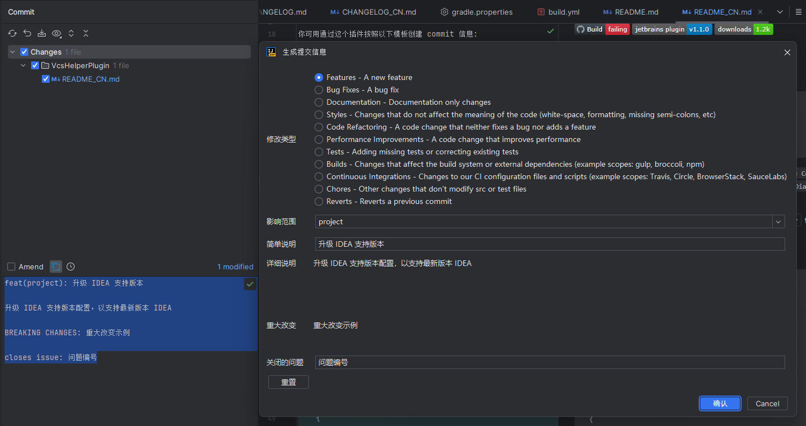
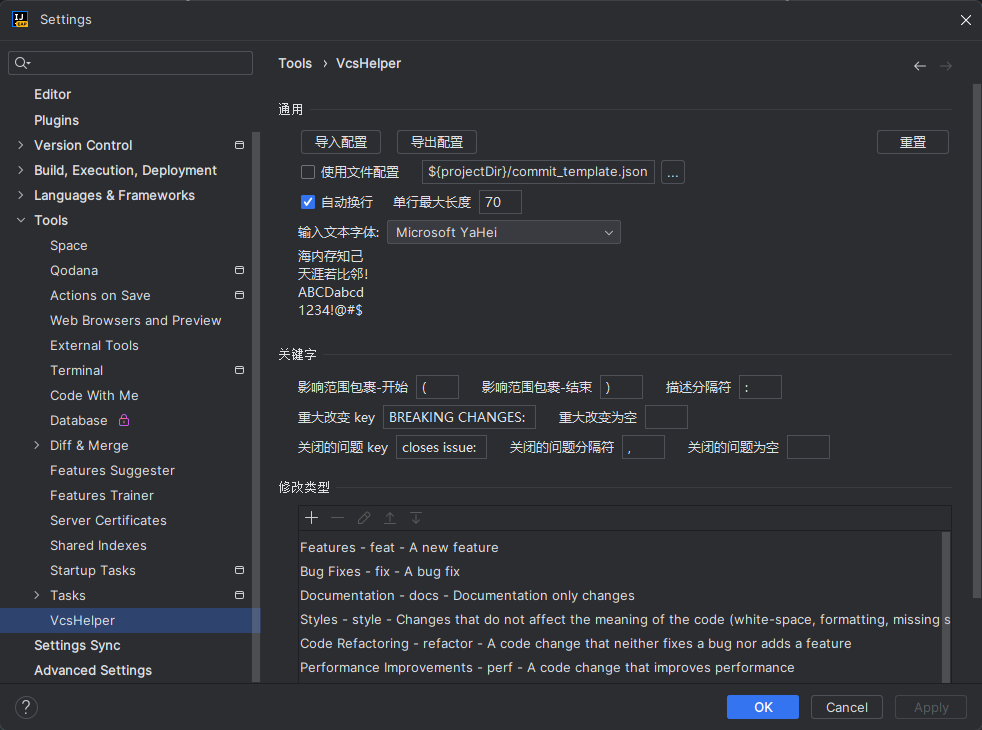

# VcsHelperPlugin


[](https://plugins.jetbrains.com/plugin/cn.wj.plugin.vcs)
[](https://plugins.jetbrains.com/plugin/cn.wj.plugin.vcs)

你可用通过这个插件按照以下模板创建 commit 信息:

```
<type>(<scope>): <subject>
<BLANK LINE>
<body>
<BLANK LINE>
<footer>
```

> 注意：
> 中文无法显示或显示异常，请在配置中修改 `输入文本字体` 为支持中文的字体

## 安装

- 使用 IDEA 插件系统:

  <kbd>Settings/Preferences</kbd> > <kbd>Plugins</kbd> > <kbd>Marketplace</kbd> > <kbd>搜索 "VcsHelper"</kbd> >
  <kbd>Install Plugin</kbd>

- 手动:

  下载 [最新释放版本](https://code.iflytek.com/osc/_source/jiewang41/VcsHelper/-/releases/) 并使用
  <kbd>Settings/Preferences</kbd> > <kbd>Plugins</kbd> > <kbd>⚙️</kbd> > <kbd>Install plugin from disk...</kbd> 进行安装

## 使用

你可以使用Commit弹窗中提交信息历史按钮前面的按钮 `Create Commit Message` 
或者使用工具栏中的按钮 `Show Create Template Dialog`  或者默认快捷键 <kbd>Alt K</kbd>来使用此功能。



你还可以通过 <kbd>Settings/Preferences</kbd> > <kbd>Tools</kbd> > <kbd>VcsHelper</kbd> 修改配置



或者添加像下面格式的 `*.json` 文件来自定义配置:
```json
{
  "keywords": {
    "wrapWords": true,
    "maxLineLength": 70,
    "scopeWrapperStart": "(",
    "scopeWrapperEnd": ")",
    "descriptionSeparator": ": ",
    "breakingChanges": "BREAKING CHANGES: ",
    "breakingChangesEmpty": "",
    "closedIssues": "Closes: ",
    "closedIssuesSeparator": ",",
    "closedIssuesEmpty": ""
  },
  "changeTypes": [
    {
      "title": "Styles",
      "action": "STYLE",
      "description": "Changes that do not affect the meaning of the code (white-space, formatting, missing semi-colons, etc)"
    },
    {
      "title": "Code Refactoring",
      "action": "REFACTOR",
      "description": "A code change that neither fixes a bug nor adds a feature"
    }
  ]
}
```

<!-- Plugin description -->

<p>
<b>
<a href="https://github.com/WangJie0822/VcsHelperPlugin">GitHub</a> |
<a href="https://github.com/WangJie0822/VcsHelperPlugin/issues">Issues</a> |
<a href="mailto:w15555650921@gmail.com">Gmail</a> |
<a href="mailto:15555650921@163.com">163</a>
</b>
</p>

This plugin allows to create a commit message with the following template:

```
<type>(<scope>): <subject>
<BLANK LINE>
<body>
<BLANK LINE>
<footer>
```

You can try the `Create Commit Message` button  in the Commit popup before `Commit Message History` or try the
`Show Create Template Dialog` button  in the MainToolbar to use this feature.

You can also customize your own build rules through <kbd>Settings/Preferences</kbd> > <kbd>Tools</kbd> > <kbd>VcsHelper</kbd>

Or add the `*.json` configuration file like this:
```json
{
  "keywords": {
    "wrapWords": true,
    "maxLineLength": 70,
    "scopeWrapperStart": "(",
    "scopeWrapperEnd": ")",
    "descriptionSeparator": ": ",
    "breakingChanges": "BREAKING CHANGES: ",
    "breakingChangesEmpty": "",
    "closedIssues": "Closes: ",
    "closedIssuesSeparator": ",",
    "closedIssuesEmpty": ""
  },
  "changeTypes": [
    {
      "title": "Styles",
      "action": "STYLE",
      "description": "Changes that do not affect the meaning of the code (white-space, formatting, missing semi-colons, etc)"
    },
    {
      "title": "Code Refactoring",
      "action": "REFACTOR",
      "description": "A code change that neither fixes a bug nor adds a feature"
    }
  ]
}
```
<!-- Plugin description end -->

## Installation

- Using IDE built-in plugin system:
  
  <kbd>Settings/Preferences</kbd> > <kbd>Plugins</kbd> > <kbd>Marketplace</kbd> > <kbd>Search for "VcsHelper"</kbd> >
  <kbd>Install Plugin</kbd>
  
- Manually:

  Download the [latest release](https://github.com/WangJie0822/VcsHelperPlugin/releases/latest) and install it manually using
  <kbd>Settings/Preferences</kbd> > <kbd>Plugins</kbd> > <kbd>⚙️</kbd> > <kbd>Install plugin from disk...</kbd>


---
Plugin based on the [IntelliJ Platform Plugin Template][template].

[template]: https://github.com/JetBrains/intellij-platform-plugin-template
